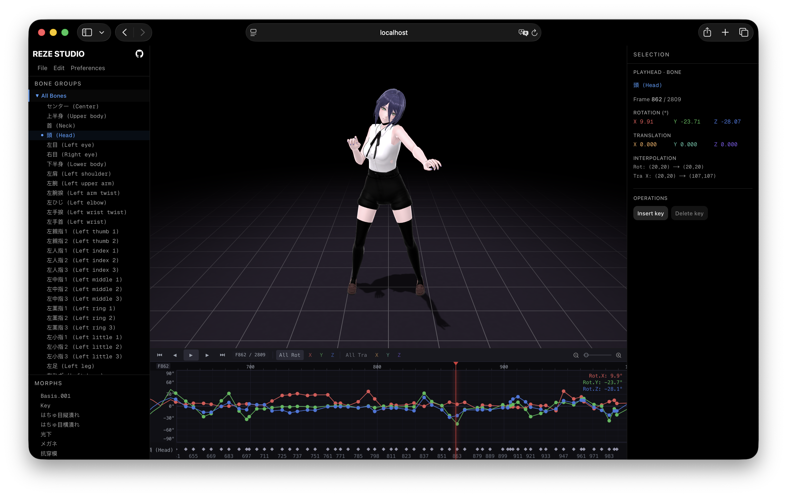

# Reze Studio

A browser-native, WebGPU-powered animation curve editor for MMD. Professional timeline, dopesheet, and per-channel Bézier editing — no install, runs on laptop / desktop / iPad, from the same URL.

**Live:** [reze.studio](https://reze.studio)



A modern, web-native take on MMD animation editing — a dedicated timeline and curve editor for hand-keying `.vmd` clips, freed from the Windows-only desktop install. It isn't a full MMD replacement (no MME-style shaders or video export yet) and it isn't trying to be Maya or Blender; it's a focused, cross-platform tool built to do the animation-editing job exceptionally well. Rendering runs directly on the GPU via WebGPU through [reze-engine](https://github.com/AmyangXYZ/reze-engine) (Ammo.js physics, IK), delivering high-frame-rate playback and fluid interaction on anything from an iPad to a gaming laptop.

## Features

- [x] PMX model and VMD animation loading and rendering with IK and physics
- [x] Timeline with dope sheet and per-channel curve editor
- [x] Bézier interpolation curve editing
- [x] Keyframe insert / delete at playhead
- [x] VMD import / export
- [x] Load user's PMX model from local folder
- [x] Bone list with grouped hierarchy
- [x] Morph list
- [x] Rotation / translation sliders with direct numeric input
- [x] Morph weight keyframing
- [x] Undo / redo for clip edits
- [x] Track operations: simplify (keyframe reduction), clear
- [x] Keyboard shortcuts
- [x] Unsaved-change warning on tab close / refresh
- [ ] Animation layers with blend weights and bone masks
- [ ] Custom bone groups with mute / solo toggle
- [ ] Clip operations: cut, copy, paste, mirrored paste (左↔右), import, time stretch
- [ ] 3D transform gizmos in viewport
- [ ] Mocap import (video → VMD)
- [ ] Overleaf-style real-time collaboration
- [ ] AI-assisted animation (generative infill, motion retargeting)

## Quick start

1. Open [reze.studio](https://reze.studio) — a default Reze model and sample clip load automatically, so you can start editing right away.
2. **(Optional) Load your own model:** `File → Load PMX folder…` and pick the folder containing your `.pmx` (textures must sit next to it).
3. **(Optional) Load an existing clip, or start from scratch:** `File → Load VMD…` to import an existing `.vmd`, or `File → New` to clear the timeline and key the animation yourself on whichever model is loaded.
4. **Play it back:** press `Space` or click the play button.
5. **Save your edits:** `File → Export VMD…`. There is no server — nothing leaves your browser, so export before you close the tab.

## A short tour of editing an animation

If you've never hand-keyed an animation before, here's the mental model. A clip is a list of **keyframes** per bone (and per morph) — snapshots of "at frame N, this bone is in this pose." The engine interpolates between keyframes so the character moves smoothly. Editing a clip means moving, adding, or tweaking those keyframes.

A typical workflow in Reze Studio:

1. **Pick a bone.** Click it in the left panel (or the dopesheet). The Properties Inspector on the right shows its rotation / translation and every keyframe on that bone.
2. **Scrub to a frame.** Drag the playhead in the timeline, or use `←` / `→` to step frame by frame. The viewport updates live.
3. **Pose the bone.** Drag the rotation / translation sliders in the inspector, or type a number directly. If there's no keyframe on that bone at the current frame, one is inserted automatically; if there is, it's updated in place.
4. **Shape the motion between keyframes.** Select a keyframe in the dopesheet and open the curve editor tab. Each channel (rotX, rotY, rotZ, tX, tY, tZ) has its own Bézier curve — drag the handles to change easing. This is where "stiff" animation becomes "alive."
5. **Delete / nudge / drag keyframes.** In the dopesheet you can drag diamonds sideways to retime, or select and delete. Arrow keys nudge by one frame.
6. **Clean up a track.** In the Properties Inspector, `Simplify` removes redundant keyframes on the selected bone (keys that the Bézier between their neighbours already reproduces within a small rotation / translation tolerance). `Clear` wipes the track entirely. Both are undoable.
7. **Undo mistakes.** `Ctrl/⌘+Z` rewinds the last clip edit; `Ctrl/⌘+Shift+Z` (or `⌘+Y`) redoes. History holds the last 100 edits. Loading a new VMD or PMX does _not_ go on the history stack — it would desync the loaded model.
8. **Repeat per bone** until the pose flows. Export to VMD.

## Keyboard shortcuts

| Key                              | Action                               |
| -------------------------------- | ------------------------------------ |
| `Space`                              | Play / pause                         |
| `←` / `→`                            | Step one frame back / forward        |
| `Home`                               | Jump to first frame                  |
| `End`                                | Jump to last frame                   |
| `Ctrl` / `⌘` + `Z`                   | Undo last clip edit                  |
| `Ctrl` / `⌘` + `Shift` + `Z`, `⌘`+`Y` | Redo                                 |
| `←` / `→` _(in frame input)_         | Decrement / increment playhead frame |
| `Shift` + mouse wheel                | Zoom the value / Y axis              |
| `Ctrl` / `Command` + mouse wheel     | Zoom the time / X axis               |

## Tech stack

- **Engine:** [reze-engine](https://github.com/AmyangXYZ/reze-engine) — WebGPU renderer, Ammo.js physics, IK solver
- **Editor:** Next.js 16, React 19, TypeScript, shadcn/ui, Tailwind

---

## Architecture

Beyond being an MMD editor, this repo is also a study in getting a timeline editor to feel snappy in React. Timeline editors are a stress test for the framework: you have a high-frame-rate playhead, multi-axis drags, thousands of keyframes, and a WebGPU canvas that must never stall — all living under the same tree as a normal React UI. This section documents how Reze Studio gets there.

### TL;DR — React engineering highlights

- **Split external stores.** Document/selection lives in `<Studio>`; transport (playhead, playing) lives in `<Playback>`. Playback ticks at rAF frequency never invalidate the undo/redo target.
- **`useSyncExternalStore` + selector pattern.** Components subscribe to a single slice (`useStudioSelector(s => s.field)`) and re-render only when that slice changes. Action bags (`useStudioActions()`) are stable and never cause re-renders.
- **Hot paths bypass React entirely.** Playback, keyframe drag, and pose slider drag all mutate refs/objects imperatively, repaint the canvas via an imperative handle, and touch React exactly once — on release.
- **`currentFrameRef` escape hatch.** The playback store owns a ref that EngineBridge's rAF loop writes to directly. Non-subscribing consumers (inspector samplers, PMX swap snapshots) read the live playhead without triggering a re-render.
- **Reducer-shaped core with snapshot-bridged undo.** Because preview-time edits mutate the live `clip` in place, the store also keeps an immutable `clipSnapshot` (a deep clone taken at the last commit/undo/redo). `commit()` pushes _that_ snapshot onto `past` — not the mutated `clip` — so history never captures mid-drag state.

### Provider tree

```
<Studio>                          external store — clip + selection (undo/redo target)
  └─ <Playback>                   external store — currentFrame, playing (never touched by rAF ticks)
       └─ <StudioStatusProvider>  external store — pmx name, fps, message (isolated from page re-renders)
            └─ <StudioPage>       layout shell + file handlers
                 ├─ <EngineBridge>          headless — all engine-coupled effects, returns null
                 ├─ <StudioLeftPanel>       memo'd — bone list, morph list, file menu
                 ├─ <StudioViewport>        memo'd — WebGPU <canvas>
                 ├─ <Timeline>              slice-subscribed — dopesheet + curve editor
                 │    └─ <TimelineCanvas>   imperative playhead + drag redraw handles
                 ├─ <PropertiesInspector>   slice-subscribed — pose sliders, morph weight (self-samples via rAF during playback)
                 └─ <StudioStatusFooter>    slice-subscribed — pmx name, fps, clip name
```

### State layers

| Layer         | Lives in                         | Notes                                                                                                       |
| ------------- | -------------------------------- | ----------------------------------------------------------------------------------------------------------- |
| Document      | `context/studio-context.ts`      | External store, slice subscriptions, undo/redo target                                                       |
| Selection     | `context/studio-context.ts`      | Bone, morph, keyframes                                                                                      |
| Transport     | `context/playback-context.ts`    | External store; `currentFrame`, `playing`; store-owned `currentFrameRef` for rAF consumers (see note below) |
| Status chrome | `components/studio-status.tsx`   | External store; pmx filename, fps, transient message                                                        |
| Engine refs   | `StudioPage`                     | `engineRef`, `modelRef`, `canvasRef`                                                                        |
| View          | local `useState` in `Timeline`   | Zoom, scroll, tab                                                                                           |
| Chrome        | local `useState` in `StudioPage` | Menubar, file pick dialog                                                                                   |

> _Transport note:_ the `currentFrameRef` is shared via `usePlaybackFrameRef()`. EngineBridge's rAF loop writes the live playhead straight into `.current` without going through `set()`, so non-subscribing consumers read the live frame without any React work.

### Subscription model

`Studio` (document/selection), `Playback` (transport), and `StudioStatus` (chrome footer) are all external stores backed by `useSyncExternalStore`. Components read via `useStudioSelector(s => s.field)` / `usePlaybackSelector(...)` / `useStudioStatusSelector(...)` so each re-renders only on its own slice, and write via `use*Actions()` which return stable bags that never cause re-renders. Wrapping the store's internal `set()` is also where undo/redo hooks in — `commit()` pushes onto `past`, `replaceClip()` (used by VMD/PMX loads and "New") clears history, and selection changes never touch the undo stack.

### Hot paths — zero React updates while interacting

The three high-frequency interactions (playback, keyframe drag, pose slider drag) all share the same shape: **mutate refs/objects imperatively, repaint the canvas via an imperative handle, and touch React exactly once on release.**

- **Playback** — `<EngineBridge>`'s rAF loop reads the engine clock, writes the live frame into the playback store's `currentFrameRef` (the single ref shared via `usePlaybackFrameRef()`), and calls `playheadDrawRef.current(frame)` — a handle `<TimelineCanvas>` exposes that repaints the playhead overlay directly. No `setCurrentFrame` per tick, so nothing re-renders, but any non-subscribing consumer (inspector pose sample, PMX swap snapshot) still sees the live frame via the ref. Auto-scroll (page-turn when the playhead leaves the viewport) lives in the same imperative path and only touches React at the rare page-turn boundary. On pause, the final frame is flushed to `setCurrentFrame` so the paused view matches what was last painted.
- **Live pose / morph readout** — `<PropertiesInspector>` samples the selected bone's pose and morph weight in isolated leaf subcomponents. While paused it subscribes to `currentFrame` and re-samples on change; while playing it runs its own small rAF loop reading `modelRef.current`'s `runtimeSkeleton` / `getMorphWeights()` directly, gated by equality so unchanged frames don't reconcile. This keeps the per-frame work out of the parent inspector and out of `<StudioPage>` entirely.
- **Keyframe drag** — `<Timeline>`'s move callbacks mutate `kf.frame` / channel values / track ordering **in place** and fire `dragRedrawRef.current()`, which bumps an internal drag version used by the static-layer cache invalidation check and redraws the canvas. `selectedKeyframes` entries are mutated in place so highlights follow the drag. On mouseup, a single `commit()` clones the track `Map`s → undo/redo snapshot + one `model.loadClip` via `<EngineBridge>`.
- **Pose slider drag** — `<PropertiesInspector>`'s `apply*Axis` / `applyMorphWeight` functions run in `"preview"` mode per drag tick: mutate the matching keyframe (or insert one) in place, then `model.loadClip + seek` for the 3D viewport. No `commit()`, so Timeline stays static and the Inspector doesn't reconcile. `<AxisSliderRow>` keeps a local thumb value during the drag so Radix doesn't snap back to the stale controlled prop. On `onValueCommit`, a single clone + `commit()` fires — and only that commit enters undo history, so a drag is one undoable unit rather than hundreds of preview frames.

### Simplify track (keyframe reduction)

MMD's interpolation model makes classic Ramer–Douglas–Peucker awkward: each frame stores a whole-row record, rotation is one quaternion governed by a single bezier shaping a slerp-t (so rotX/rotY/rotZ share a segment, not independent curves), and translation has three independent per-axis beziers. Reze Studio uses a **Schneider-style top-down fit** native to that model rather than dropping keys one at a time:

1. Densely sample the original track at every integer frame across `[first, last]`.
2. Try to fit one VMD segment over the whole span — four independent beziers (rotation slerp-t + tX/tY/tZ). For each, seed handles from endpoint-velocity matching against the dense samples, then refine with a coarse 5⁴ grid in 127-space + a local 5⁴ pass around the winner.
3. If max pointwise error ≤ ε (geodesic angle for rotation, per-axis for translation), emit one keyframe and collapse every intermediate key.
4. Otherwise split at the original key nearest the worst-deviation frame and recurse on both halves.
5. Adjacent original keys are kept verbatim, including their authored interpolation.

The earlier greedy "drop if tolerated" pass had a subtle failure: dropping a key inherited the surviving key's bezier handles, which were authored for a shorter segment — stretching them across a longer span warped the velocity profile and produced visible jitter even with tight pointwise ε. Custom-fitting per emitted segment removes that. Fixed tolerances `0.5°` / `0.01` units, no user knob. The whole operation lands as one `commit()`, so a simplification is one undo step.

### Where each piece lives

| File                                  | Responsibility                                               |
| ------------------------------------- | ------------------------------------------------------------ |
| `app/page.tsx`                        | Next.js entry — mounts all providers + `<StudioPage />`      |
| `context/studio-context.ts`           | Document + selection store, `useStudioSelector`, actions     |
| `context/playback-context.ts`         | Transport store, selectors, actions, `usePlaybackFrameRef`   |
| `components/studio.tsx`               | `StudioPage` — layout, file handlers, menubar, export        |
| `components/studio-status.tsx`        | Status-bar store + `<StudioStatusFooter>`                    |
| `components/engine-bridge.tsx`        | Engine-coupled effects (init, seek, play, rAF playback loop) |
| `components/timeline.tsx`             | Dopesheet + curve editor, imperative playhead / drag redraw  |
| `components/properties-inspector.tsx` | Pose sliders, morph weight, interpolation editor             |
| `components/axis-slider-row.tsx`      | Slider row with preview/commit split + local-drag value      |

## Development

```bash
npm install
npm run dev     # http://localhost:4000
```

## License

GPLv3
